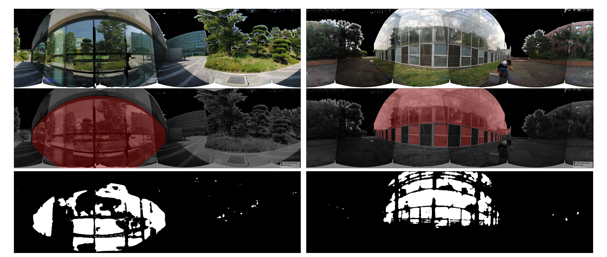

# Unet based glass-detection in projected point cloud panorama image

Simple UNet based glass region detection 

UNet : https://github.com/qubvel/segmentation_models.pytorch , 0.2.0

Dataset, UNIST Large scale reflection removal dataset : https://vip.unist.ac.kr/large-scale-3d-point-clouds-dataset-for-virtual-point-removal/

Pytorch  1.9.1  
Cuda : 9.0  
albumentations 1.1.0 (data augmentation)  
Dataset was labeled with https://github.com/wkentaro/labelme   

Input to Unet : projected point cloud counts, RGB, closest distance 

